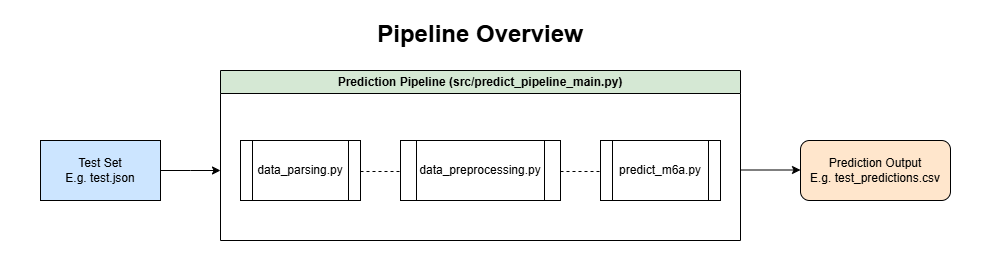

# DSA4262 - Identification of RNA Modifications from direct RNA-Seq data
By: Group dna1234

## Table of Contents
* [Project Description](#1-project-overview)
* [Directory Structure](#2-directory-structure)
* [Installation Guide](#3-installation-guide)
* [Predict m6A Pipeline](#4-predict-m6a-pipeline)
* [Model Training Pipeline](#5-model-training-pipeline)


## 1. Project Overview
### a. Project Description
RNA modifications are chemical changes to RNA bases that can influence gene expression and function. Among these, m6A is one of the most prevalent modifications found in mRNA. This project aims to detect m6A sites by developing a machine learning classifier trained on direct RNA-Seq data.  

Through feature engineering, model experimentation and hyperparameter tuning, a **Random Forest** model was selected as the best performer, optimized specifically for PR-AUC to address the class imbalance in the dataset.

### b. Model Selection and Development
We evaluated 6 machine learning models using an optimized feature set:
* Logistic Regression (baseline comparison)
* Random Forest
* XGBoost
* Neural Network
* CatBoost
* LightGBM

To handle the class imbalance, we experimented with both undersampling and oversampling techniques. The process also included hyperparameter tuning and calibration adjustment. Model performance was primarily assessed using PR-AUC, and based on these results, **Random Forest** was selected as the final model for implementation and deployment. 

For details on the training workflow, see [Section 3: Installation Guide](#3-installation-guide) and [Section 5: Model Training Pipline](#5-model-training-pipeline). Additionally, Jupyter Notebooks exploring individual models are available in the `notebooks` directory for reference.  


### c. Prediction Pipeline Description
This pipeline is designed to predict m6A RNA modifications from raw `.json` sequencing data. It consists of several key stages:  
1. Data Parsing and Summarization  
The pipeline reads the raw `.json` input and extracts relevant information such as transcript IDs, positions, sequences, and initial features. It then summarizes the data into a structured format suitable for downstream processing.  


2. Preprocessing and Feature Engineering  
The extracted data undergoes preprocessing, including one hot encoding and log transformations, and other feature engineering steps. This ensures that the input features are scaled and formatted appropriately for the machine learning model.  


3. Prediction using Pre-trained Random Forest  
The preprocessed data is fed into a pre-trained Random Forest model, which outputs predictions for m6A modifications. 

4. Output Generation  
Predictions are saved to an output directory in a structured format (CSV) and the results can be used for downstream analysis or visualizations.  

For a detailed guide on running the pipeline and generating predictions, please see [Section 3: Installation Guide](#3-installation-guide) and [Section 4: Predict m6A Pipeline](#4-predict-m6a-pipeline). 

Below is a visual overview of the prediction pipeline workflow:



## 2. Directory Structure
```
DSA4262---dna1234
├── data/
|   └── data.info.labelled
|   └── test.json
|
├── src/
|   └── data_parsing.py
|   └── data_preprocessing.py
|   └── predict_m6a.py
|   └── predict_pipeline_main.py
|   └── train_model.py
|   └── training_pipeline_main.py
|   └── utils.py
|   └── __init__.py
|
├── resources/
|   └── kmer_seq_encoder.joblib
|   └── rf_model.joblib
|
├── output/
|
├── notebooks/
|
├── task2/
```


## 3. Installation Guide
### 1. Open AWS Ubuntu Instance:
````
ssh -i <machine-name>.pem user@hostname

# Example (Ronin Instance)
ssh -i <machine-name>.pem ubuntu@<machine-name>.nus.cloud
````

### 2. Clone the repository:
````
git clone https://github.com/janisthx/DSA4262---dna1234.git
````

### 3. Install Pixi on Unix  
* Pixi is a fast, modern package manager for creating reproducible environments. It manages all project dependencies through a single `pixi.toml` file, ensuring consistent setups across systems. 

* To get started, install Pixi on your AWS Ubuntu instance before running any project commands:
````
curl -fsSL https://pixi.sh/install.sh | sh
````

### 4. Source your shell configuration  
* After installation, reload your shell configuration to activate Pixi:
````
source ~/.bashrc
````

### 5. Verify the installation  
* Confirm that Pixi was installed successfully:
````
pixi --version
````

## 4. Predict m6A Pipeline
Follow these steps to generate m6A modification predictions using the pre-trained Random Forest model:
### 1. Complete the instructions in [Section 3: Installation Guide](#3-installation-guide) before continuing.  

### 2. Navigate to the project root directory
* Change to the main folder of the project, where all scripts, data, and configuration files are located.
* This ensures that all file paths used by the pipeline are correctly resolved.  

````
cd ~/DSA4262---dna1234
````


### 3. Activate the Pixi environment
* Install and activate all project dependencies defined in the `pixi.toml` file:

````
pixi install
````
### 4. Place your test set in the `data` directory
* For testing purposes, we provide a small test set to run the pipeline. This file is called `test.json`.
* Check that your test set is in:
````
ls data

# Expected Output:
test.json

# To see first 5 lines:
head -n 5 data/test.json
````


### 5. Run pipeline to get predictions
* Execute the main script with your dataset to obtain predictions  
````
pixi run python src/predict_pipeline_main.py --filename <filename> --verbose

# Example (Copy this command for test run)
pixi run python src/predict_pipeline_main.py --filename test --verbose
````
* Replace `<filename>` with the name of your dataset file without the extension `.json`
    * E.g. `--filename test` if the full name of the file is test.json
* The `--verbose` flag enables detailed logging so that the progress can be monitored.  


### 6. Check the output
* After the pipeline completes, the prediction results will be saved in the `output` directory.  
````
ls output

# Expected Output:
test_predictions.csv

# To see first 5 lines:
head -n 5 output/test_predictions.csv
````
Look for your generated CSV file containing m6A modification predictions. E.g. `test_predictions.csv`


## 5. Model Training Pipeline
Follow these steps to reproduce the Random Forest model: 

### 1. Complete the instructions in [Section 3: Installation Guide](#3-installation-guide) before continuing.  
#### Note: This section (Section 5: Model Training Pipeline) is NOT part of the prediction test run. This is purely for reproducing the model using the training set (dataset0).

### 2. Navigate to the project root directory
* Change to the main folder of the project, where all scripts, data, and configuration files are located.
* This ensures that all file paths used by the pipeline are correctly resolved.  

````
cd ~/DSA4262---dna1234
````


### 3. Activate the Pixi environment
* Install and activate all project dependencies defined in the `pixi.toml` file:

````
pixi install
````

### 4. Place your training set in the `data` directory
* Ensure that both the raw `.json` file and labelled data file (m6A labels) are in the `data` directory.


### 5. Run pipeline to get predictions
* Execute the main script with your dataset to train the model
````
pixi run python src/training_pipeline_main.py --data_filename <data-filename> --label_filename <label-filename> --verbose

# Example
pixi run python src/training_pipeline_main.py --data_filename dataset0 --label_filename data.info.labelled --verbose
````
* Replace `<data-filename>` with the name of your dataset file without the extension `.json`
    * E.g. `--data_filename test` if the full filename is test.json
* Replace `<label-filename>` with the name of your labelled file with the extension  
    * E.g. `--label_filename data.info.labelled` if the full filename is data.info.labelled  
* The `--verbose` flag enables detailed logging so that the progress can be monitored.  


### 6. Check the output
* After the pipeline completes, the trained model will be saved in the `resources` directory.  
````
ls resources

# Example of Model Object:
dataset0_trained_model.joblib
````
Look for your trained model. E.g. `dataset0_trained_model.joblib`
